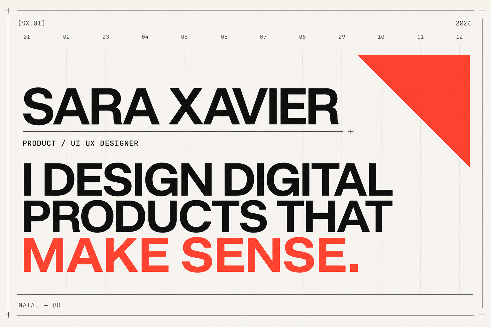

# Sara Xavier — Digital Product Designer

Bilingual product design portfolio built around visual clarity, product thinking, and personality.

[View the portfolio](https://sara-xavier.github.io/sara-xavier-portfolio/)



## Direction

- Contemporary editorial layout with a visible 12-column rhythm
- Warm off-white, near-black, and signature coral palette
- English and Portuguese interface
- Oversized typography, technical markers, and restrained motion
- Three detailed, self-initiated concept case studies
- Responsive and accessible by default

## Content status

Luma, Orbit, and Noma are demonstration case studies. Their research narratives and outcomes are explicitly marked as concept content and should be replaced with evidence from Sara's real projects before professional use.

## Local development

```bash
npm install
npm run dev
```

Open the local address shown in the terminal.

## Production build

```bash
npm run build
```

## Next content pass

- Replace the demonstration case studies with real project evidence
- Add Sara's email, LinkedIn, Behance, and résumé
- Add real prototype and Figma links where appropriate
- Review copy and metrics against source material

© 2026 Sara Xavier
